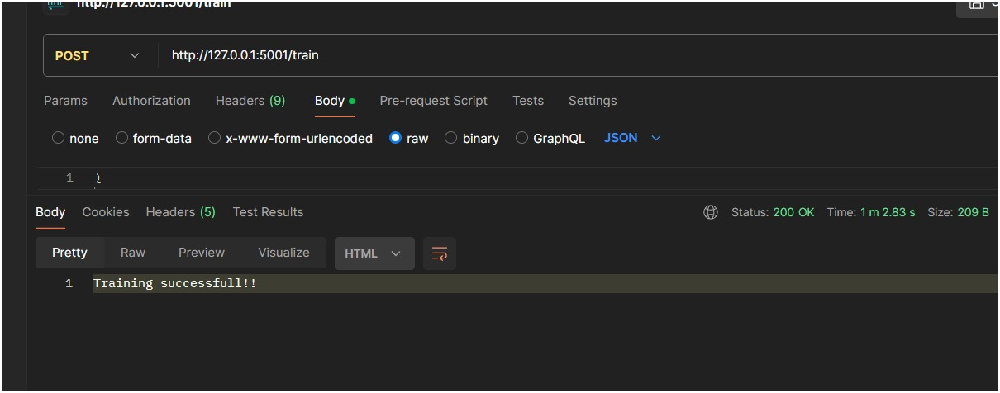
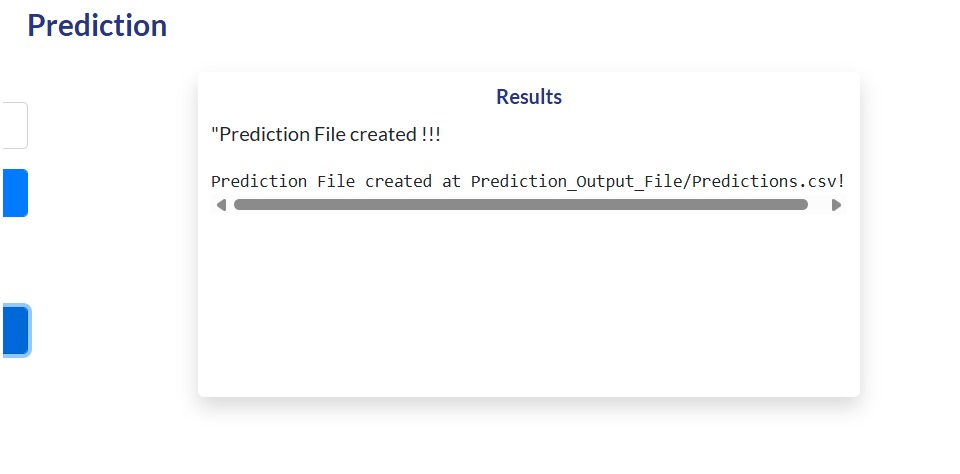

# 🧠 ML Model Training API with Flask

# 📌 Project Description
 ## Key Features

This is a **Flask-based machine learning model** that triggers model training and predictions on structured CSV data files. It incorporates:

- Utilizes Python libraries such as:
  - 📦 `NumPy`, `Pandas` for data handling
  - 🧩 `KNNImputer` for imputing missing values
  - 📏 `StandardScaler` for feature scaling
  - 📊 `KMeans` and `KneeLocator` for data clustering
  - 🧠 `RandomForestClassifier` and `LogisticRegression` for modeling
- Includes robust validation and preprocessing pipelines before training.
- **SQLite** as the database.

---

## 🔁 Workflow Overview

### ✅ 1. File Validation

- Validates incoming files based on **enterprise data naming conventions** using regex.
- Enforces schema compliance: column count, column names, and missing value checks.
- Converts validated input into a **standardized CSV format** for downstream processing.

---

### 🧹 2. Data Preprocessing

- Handles missing data using **KNNImputer**.
- Cleans and prunes irrelevant or noisy features.
- Applies:
  - 🔧 **Feature engineering** techniques
  - 📉 **Log transformation** to normalize distributions
  - 📏 **Standard scaling** for model compatibility
- Segregates target variables from features to ensure clean modeling.

---

### 🧪 3. Clustering & Model Selection

- Segments the dataset using **KMeans** clustering.
- Uses **KneeLocator** to auto-select the optimal number of clusters.
- For each cluster:
  - Performs model training with **Random Forest** and **Logistic Regression**
  - Runs **hyperparameter tuning** via grid search to optimize performance
- Selects the **best-performing model per cluster** based on accuracy and business-specific metrics.

---

### 📦 4. Model Saving & Prediction

- Models are saved using **joblib**, organized by cluster for easy retrieval.
- Incoming prediction data:
  - Undergoes the same validation and preprocessing steps
  - Is routed to the appropriate model based on cluster assignment
- Returns predictions along with **confidence scores** or metrics.
- Supports **batch and real-time prediction modes** (with further adaptation).

---

### 🏢 Industry Application Use Case

This project mimics a **production-grade machine learning pipeline** suitable for:

- 🏥 **Healthcare diagnostics**: Assigning patient records to cluster-specific predictive models.
- 💼 **Finance**: Risk profiling and fraud detection using behavioral segmentation.
- 📦 **Retail**: Product recommendation and demand forecasting tailored to customer segments.
- ⚙️ **Manufacturing**: Predictive maintenance using sensor data clusters.

---

## 📁 Project Structure

```
├── app.py #  Main Flask application (API endpoints for training and prediction)
├── training_Model.py #  Contains logic for training models on clustered data
├── training_validation_insert.py #  Validates and inserts training data files
├── Training_Batch_File/ #  Directory to store incoming training data files
├── prediction_validation_insert.py #  Validates and inserts prediction data files
├── Prediction_Batch_File/ #  Directory to store incoming prediction data files
├── predictionModel.py #  Executes the prediction pipeline using saved models
├── templates/ # 🖼 HTML templates for the web UI (Flask Jinja2 views)
├── requirements.txt #  List of required Python dependencies
└── README.md #  Project documentation (you’re here!)
```

---

## 🚀 Features

✅ Accepts JSON request with folder path

✅ Regex-based file validation for training and prediction datasets

🧹 Automated data preprocessing with imputation, scaling, and log transformation

📊 KMeans clustering to segment data for model-specific training

🧠 Model training with RandomForest and LogisticRegression per cluster

🧪 Hyperparameter tuning for optimal model performance

💾 Model saving and reuse for production-ready predictions

📈 Prediction workflow mirrors training for consistency and accuracy

🖥️ Web UI support via HTML templates for user interaction

---

## 📡 API Endpoint

### Launch Screen

**Sample Output Screenshot**:


### `POST /train`

**Request Body:**
```json
{
  "folderPath": "Training_Batch_Files"
}
```

**Response:**
- ✅ Success: `"Training completed successfully."`
- ❌ Error: `"Error occurred! <Exception Details>"`

**Sample Output Screenshot**:




---

### 📈 `POST /predict`
**Description**: Performs prediction using a trained model on input CSV data.

**Request Body**:
```json
{
  "filepath": "Prediction_Batch_Files/inputFile.csv"
}
```

**Response**:
- `200 OK` with message and prediction file output stored in the `Prediction_Output_File/` directory.

**Sample Output Screenshot**:




---

## 🔧 How to Run

### 1. Clone the Repository
```bash
git clone https://github.com/your-username/ml-training-api.git
cd ml-training-api
```

### 2. Create & Activate Virtual Environment
```bash
# Windows
python -m venv venv
venv\Scripts\activate

# macOS/Linux
python3 -m venv venv
source venv/bin/activate
```

### 3. Install Dependencies

### 4. Run the Flask Server
```bash
python app.py
```

Server will run on: `http://127.0.0.1:5001`

---


